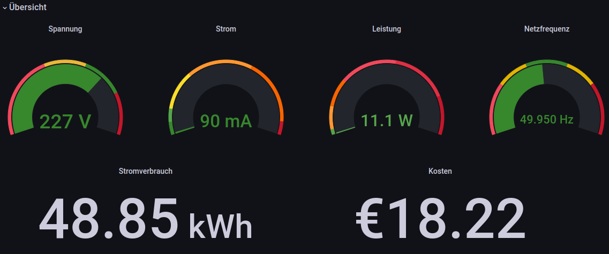

# SDM120 & Shelly 3EM Pro --> ESP32 --> InfluxDB

- ### SDM120
The sketch can be used to get data from an Eastron SDM120 Modbus Meter using an ESP32 Microcontroller and then sending the data to InfluxDB. 
You need a TTL to RS485 Module converter with Automatic Flow Control for this example sketch.

- ### Shelly 3EM Pro
The Shelly should be connected to the local W-Lan network and must have a fixed IP Adress.

- ### e.g. Grafana
InfluxDB can then be used for example with Grafana, see Screenshot:

